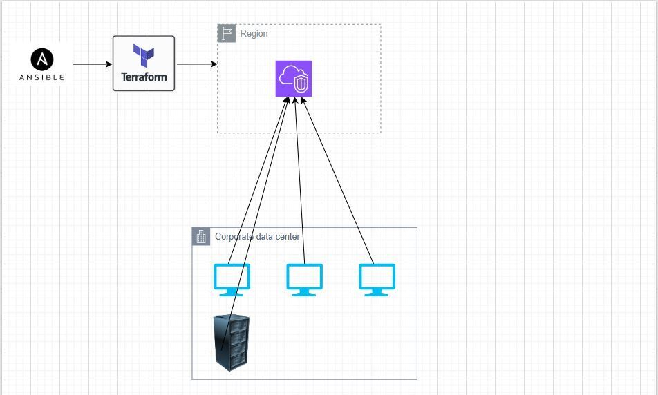

When working in Multi-Cloud and Hybrid Environment , the challenge to automate is bigger then ever. Too many tools and too many best practices. Propriety Cloud IAC Services/tools
- Azure Resource Manager (ARM) templates
- GCP Cloud Deployment Manager
- OCI Resource Manager
- AWS CloudFormation

Then we have Terraform and Ansible, provision and configure. Once terraform provision infra resources in cloud ansible then configure resource (say webserver).
But if there is bigger challenge provision resource in AWS , then with that resource information to connect, should be configure in multiple cloud , on premise , industrial facility or remote sensors(iots) all over the city.

To perform this , one should have knowledge and experience of below:
    Ansible
    Terraform

Related Links:

    https://docs.ansible.com/ansible/latest/collections/community/general/terraform_module.html#ansible-collections-community-general-terraform-module

    https://registry.terraform.io/modules/terraform-aws-modules/rds/aws/latest
